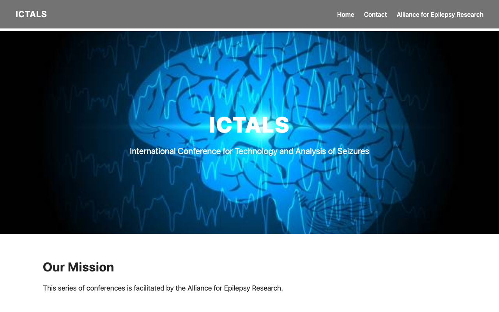

# ICTALS.org



Website for the **International Conference for Technology and Analysis of Seizures (ICTALS)** — a recurring academic conference series on seizure prediction and epilepsy research, facilitated by the [Alliance for Epilepsy Research](http://www.epilepsyresearch.org/).

Built with [Statamic](https://statamic.com) (flat-file CMS on Laravel) and deployed at [ictals.org](https://ictals.org).

## Requirements

- PHP 8.3+
- Composer
- Node.js + npm

## Setup

```bash
composer setup
```

This installs PHP and JS dependencies, generates an app key, runs migrations, and builds frontend assets.

## Development

```bash
composer dev
```

Starts the Laravel server, queue worker, log tail, and Vite HMR all concurrently.

To build frontend assets for production:

```bash
npm run build
```

## Tests

```bash
composer test
```

## Content Management

Content is managed through the Statamic Control Panel at `/cp`. Editors can update:

- **Homepage** — mission statement text and the featured upcoming event (via the `Homepage Content` global)
- **Events** — add/edit past and future ICTALS conferences via the `Events` collection; toggle `Move to Past Events` to control homepage placement
- **Archive Events** — older IWSP/ICTALS entries

All CP edits are automatically committed to git via Statamic's git automation (`STATAMIC_GIT_ENABLED=true`).

## Key Environment Variables

```env
APP_URL=https://ictals.org
STATAMIC_LICENSE_KEY=
STATAMIC_GIT_ENABLED=true
STATAMIC_GIT_AUTOMATIC=true
```

## Tech Stack

| Layer | Technology |
|---|---|
| CMS | Statamic v6 |
| Framework | Laravel 13 |
| Templating | Antlers (`.antlers.html`) |
| CSS | Tailwind CSS v4 |
| Build tool | Vite |
| Database | SQLite (sessions/auth only — content is flat-file) |
